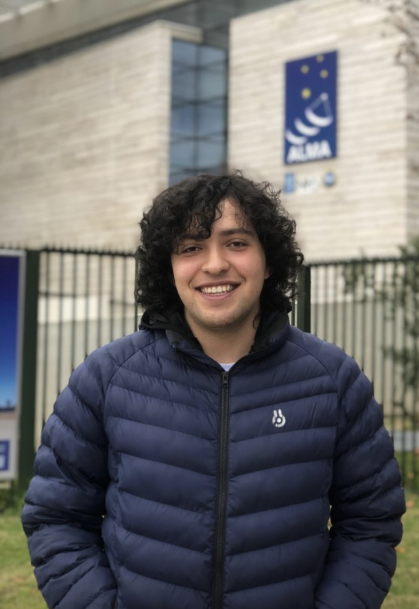

<head>
    <link rel="icon" href="resources/images/favicon.png" type="image/x-icon">
    <link rel="shortcut icon" href="resources/images/favicon.png" type="image/x-icon">
    <link rel="apple-touch-icon" href="resources/images/favicon.png"> <!-- Optional, for iOS devices -->
</head>

    
    <h2>
        <a href="#home">Home</a> | 
        <a href="#cv">CV</a> | 
        <a href="#publications">Publications</a> | 
        <a href="#talks">Talks</a> | 
        <a href="#awards">Awards</a> | 
        <a href="#contact">Contact</a>
    </h2>

---

## 🌌 About Me

As a Colombian Astronomy undergraduate at Pontificia Universidad Católica de Chile, I am captivated by the mysteries of the cosmos, where I can apply and integrate diverse skills into impactful research. My academic journey has been marked by rigorous training and participation in prestigious international competitions, such as IOAA and OLAA.

    

I am passionate about the intersection of astronomy and technology, where coding meets the cosmos. Driven by curiosity I am eager to contribute to the field of astronomy through innovative research and collaboration.

- **Education:** Currently Undergraduate in Astronomy, Pontificia Universidad Católica de Chile
- **Languages:** Spanish (Native), English (B2)
- **Interests:** Astronomy, Astrophysics, Physics, Mathematics, Coding, Photography, Music

---

## 🧠 Research Interests

- Astrophysics
- Stellar and Galactic Dynamics
- Computational Astronomy
- Astrophotography
- Science Communication

---

## 📄 CV

[Download my CV](resources/docs/CV__EN_-2.pdf) <!-- Replace with your CV link -->

---

## 📚 Publications

### Comparison between Different Methods to Determine the Distance to LMC
*Research Project - Colegio Andino de Tunja, 2023*

---

## 🗣 Talks

### Messier Objects and Astrophotography
*Presented at the National Astronomy Meeting (RAC) 2023, November 2023*

---

## 🏅 Awards

- **Honorable Mention (HM)** at the XVII International Olympiad on Astronomy and Astrophysics (IOAA), 2024
- **Bronze Medal** at the XV Latin America Olympiad on Astronomy and Astrophysics (OLAA), 2023
- **Second Place** at the Colombian Astronomy Olympiads (Universidad Antonio Nariño), 2023
- **Participation** at the XVI International Olympiad on Astronomy and Astrophysics (IOAA), 2023
  
---

## 🛠 Skills

- **Programming Languages:** Python
- **Tools:** LaTeX, Markdown, Wiki.js
- **Soft Skills:** Problem Solving, Analytical Thinking, Communication

---

## 📞 Contact

- **Email:** [iCloud Mail](mailto:markers-basic.0m@icloud.com)
- **LinkedIn:** [LinkedIn](https://www.linkedin.com/in/jj-sm/) <!-- Replace with your LinkedIn profile link -->

---

<!-- Optional: Add a footer with links to social media or additional resources -->
